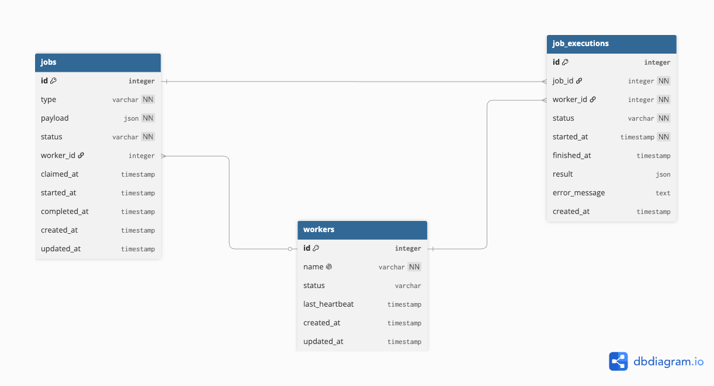

# Distributed Job Queue

A robust, database-backed distributed job queue implemented in Django without relying on external brokers like Redis or RabbitMQ. This project demonstrates advanced database concepts, including transaction isolation, row-level locking (`SELECT FOR UPDATE`), and handling race conditions in concurrent distributed environments.

## 🚀 Key Features

- **Database-Backed Queue**: Uses your existing relational database (SQLite/PostgreSQL) as the message broker, ensuring strong consistency guarantees.
- **Concurrency & Race Condition Handling**: Safely handles concurrent job claims using `SELECT FOR UPDATE SKIP LOCKED` and prevents duplicate job creation issues with explicit `IntegrityError` handling.
- **Worker Management**: Production-ready worker daemon with graceful shutdown (SIGINT/SIGTERM handling), configurable polling, and heartbeat updates.
- **Job Retries & Recovery**: Complete retry logic with atomic read-modify-write locking, and automatic reclaiming of expired jobs if a worker process crashes.
- **Audit Trail**: Maintains a separate `JobExecution` history for debugging, observability, and retry pattern analysis.

## 📚 Documentation

The project includes extensive documentation detailing its architecture and design decisions:

- [Quick Start Guide](QUICKSTART.md) - Get up and running in 5 minutes.
- [Race Condition Handling](RACE_CONDITION_HANDLING.md) - Deep dive into how database race conditions are mitigated.
- [Comparison with Celery](COMPARISON_WITH_CELERY.md) - Trade-off analysis versus dedicated task queues like Celery.
- [Deadlock Analysis](DEADLOCK_ANALYSIS.md) - How deadlocks are prevented in concurrent transactions.
- [Proof of No Duplicate Claiming](PROOF_NO_DUPLICATE_CLAIMING.md) & [Answer to No Duplicate Claims](ANSWER_NO_DUPLICATE_CLAIMS.md) - Evidence and reasoning on strict exactly-once processing guarantees.


## 🛠️ Project Structure

```text
distributed-job-queue/
├── config/                  # Django project configuration
├── ERD/                     # Entity Relationship Diagrams
│   └── ERD.png              
├── job/                     # Job application
│   ├── management/commands/ # Worker daemon commands
│   ├── migrations/          
│   ├── models/              # DB Models: Job, JobExecution
│   ├── serializers/         # DRF Serializers
│   ├── services/            # Business Logic Layer (Race condition handling)
│   ├── tests/               # Comprehensive tests for concurrency
│   └── views/               # DRF Views
├── worker/                  # Worker application
│   ├── migrations/          
│   ├── models/              # DB Models: Worker
│   └── ...               
├── manage.py                
├── requirements.txt         
└── README.md                
```

## 📊 Entity Relationship Diagram (ERD)



## 🚦 Getting Started

1. **Setup Database**: 
   ```bash
   python manage.py makemigrations
   python manage.py migrate
   ```
2. **Start the Django Server**:
   ```bash
   python manage.py runserver
   ```
3. **Start Workers**:
   ```bash
   python manage.py run_worker --name worker-1
   ```

For detailed instructions and code examples, refer to the [Quick Start Guide](QUICKSTART.md) and run [example_usage.py](example_usage.py).

## 🧪 Running Tests

The test suite includes extensive testing for concurrent job creation, claiming, and state transitions using multiple simulated workers.

```bash
python manage.py test job.tests.test_race_conditions -v 2
```
